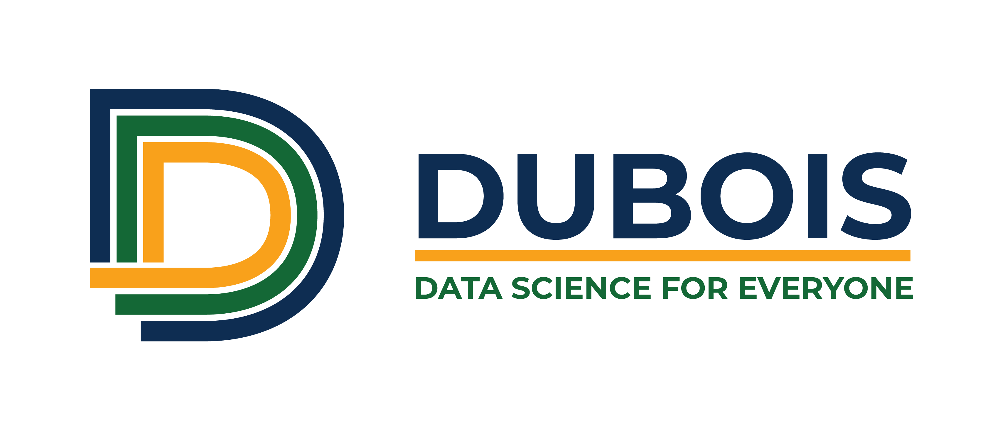

# DUBOIS

Collaborative development of a new introductory, interdisciplinary course for computing, data science, and society.
* The introductory Data Science curriculum is at the intersection of computing, statistics, and the social and behavioral sciences. The course consists of scaffolded modules designed to promote effective engagement with modern socio-technical systems.
* This partnership developes course modules in teams composed of members from institution with the intention of sharing interdisciplinary knowledge, experience with a variety of students, and range of classroom practices.

# Project Events

* **Summer 2024**: UC Berkeley Data 6 starts implementing some of the new curriculum. Almost ready to share...!
* **June 2024**: We are excited to welcome LA City College, who will be teaching Data 6 starting this Fall 2024.
* **June 2024**: We held an in-person curriculum workshop co-located with the National Workshop on Data Science Education at UC Berkeley! Please see [our presentation slides](https://docs.google.com/presentation/d/1wU6hVHxOwugU3N49k4ytHgdJ1XXrirn-dpu_wbpaYmk/edit?usp=sharing).
* **Spring 2024**: Exploratory course offering with UC Merced's Spark Seminar, targeted towards campus freshmen from all disciplines.
* **Fall 2023**: Initial collaboration and idea design.
* **Summer 2023**: Pilot set of modules in UC Berkeley's Summer [Data 6](https://data6.org/su23/).

# Curriculum Overview

This project plans for four course modules, built as 2-3 week units and designed by interdisciplinary, inter-institutional teams:
* Fundamental Data Structures for Data Science. Bortfeld (chair).
* Visualization, Gender, and Education. Yan (chair).
* Social Application Core: Algorithms and Functions. Marcia (chair).
* Text processing and data analysis. Ndoye (chair).

Full curriculum to come soon!

## Project Funding
This project is funded by the following sources:
* This material is based upon work supported by the U.S. National Science Foundation under award Nos. [2245877](https://www.nsf.gov/awardsearch/showAward?AWD_ID=2245877), [2245878](https://www.nsf.gov/awardsearch/showAward?AWD_ID=2245878), [2245879](https://www.nsf.gov/awardsearch/showAward?AWD_ID=2245879). NSF [IUSE CUE](https://new.nsf.gov/funding/opportunities/improving-undergraduate-stem-education-computing): "Collaborative Research: Developing inclusive, interdisciplinary undergraduate data science curricula in computing and social science."
* **California Learning Lab**. Collaborative Design of Interdisciplinary, Inclusive, Introductory Data Science Course Modules \[[link](https://calearninglab.org/project/collaborative-design-of-interdisciplinary-inclusive-introductory-data-science-course-modules/)\]

## Project Naming

Why DUBOIS? At the core of our activities, we would like to support **D**ata science for **U**ndergraduates to **B**roaden **O**pportunities for advancing an **I**nclusive **S**ociety. W.E.B. Du Bois was a prominent 20th century African American activist who leveraged data science and visualization to advocate for Pan-African civil rights.
