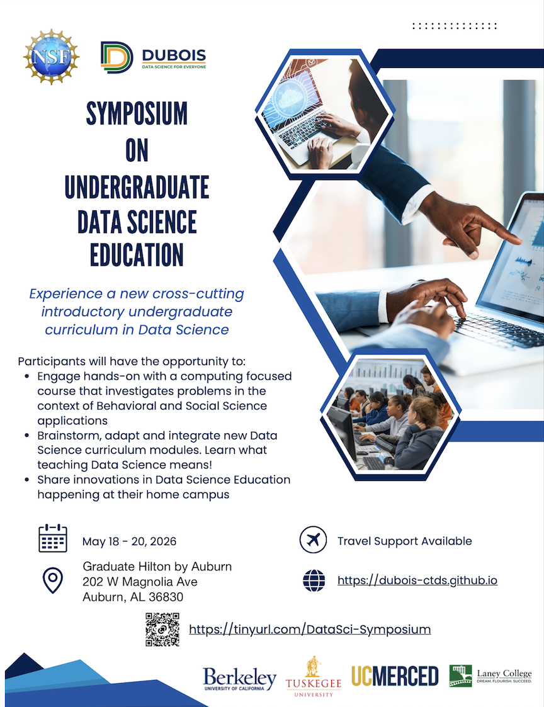

You are cordially invited to our first Symposium on Undergraduate Data Science Education on May 18-20, 2026 at the Auburn University Dixon Conference Center in Auburn, Alabama.

The purpose of this symposium is to convene faculty and students with interest in promoting Data Science Education to experience the DUBOIS Data Science and explore the adaptability of this curriculum on their campuses. We are planning several hands-on sessions at the Symposium where participants will directly engage with the curriculum.

## Symposium Objectives

1. **Knowledge Exchange**: To foster knowledge sharing and innovations in Data Science Education for Undergraduates
1. **Community Building**: To foster community amongst Data Science educators and learners
1. **Emerging Trends**: To explore emerging trends and potential best practices and address challenges in teaching and learning Data Science on college campuses
1. **Mentorship Opportunities**: To facilitate connections between experienced Data Science educators and those newer to the field
1. **Presenting Findings**: To share advancements and methodologies in Data Science Education

Symposium activities will include a broad range of sessions, such as panels, poster presentations and time for participants to reflect on a potential for working collaboratively to advance Data Science opportunities on their campuses.

## Participants

We highly encourage participation by small interdisciplinary teams of 2-3 Faculty Members from each institution (e.g. Computer Scientists, Engineers, Mathematicians, Social and Behavioral Scientists) who have an interest in starting a Data Science curriculum on their campuses or enhancing an existing one. *We strongly encourage teams of faculty or faculty and students from the same institution to attend the Symposium.* Single Faculty participation is welcomed as well. Faculty may also bring interested students with them!

## Venue Information

**Location**: Graduate Hilton by Auburn; 202 W Magnolia Ave, Auburn, AL 36830 ([update 3/3: instead of the earlier Auburn University Conference Centre])

**Symposium Dates/Times**: The Symposium will start on May 18 at 12 PM and conclude on May 20 at 12 PM. An agenda is forthcoming.

**Travel Funds**: Funds are available to support participant travel, based on need (opportunities are limited). More information below.

<!--
## Register to Participate

Please complete the participation interest form: [https://tinyurl.com/DataSci-Symposium](https://tinyurl.com/DataSci-Symposium)

**PRIORITY DEADLINE**: Feb 15, 2026 (to be considered for travel support)
-->

## Participant Details

### Getting to the Venue

For those who will be travelling by air, the closest recommended airport with the most flight options is Atlanta's Hartfield Jackson International airport. Auburn is about 100 miles from the airport via I-85. There is a convenient shuttle service ([Groome Transportation](https://groometransportation.com/auburn/?&sd_client_id=3592e67a-8239-4172-b354-685ad6e9a711)) that connects the airport with the Groome central office in Auburn, in addition to many car rental options. As you plan your travels, please note that ATL is on EASTERN time zone while Auburn is on CENTRAL time zone.

### Lodging

A block of rooms has been set aside at the Holiday Inn Express located at 2013 South College Street, Auburn, AL 36832. The Graduate Hilton by Auburn where the Symposium will be held is 3 miles from the hotel. 

To book your room for this hotel block, please check your email for the Google Form that we sent out to pre-registered participants.

### Travel Support Process
We have a limited amount of travel funding that we would like to use (1) to support participants from as many institutions as possible, and (2) to encourage small teams from institutions.

* Tuskegee University, which is one of the four partner DUBOIS institutions, can reimburse participants for travel related costs, used to cover air fare, lodging and ground transportation for a maximum of $1,000 / person.
* In the Google Form that we sent out to pre-registered participants, please indicate which team members may need this support.
* If travel support is approved, Tuskegee University can reimburse each participant's travel related costs in the form of what it calls "Non-University Stipend". We therefore request you to pay for these expenses upfront and based on your total costs, the University will issue a check in that amount, but not exceeding ($1,000). Please keep all receipts.

## Contact

For any questions, please email: Dr. Mohammed Qazi (mqazi at tuskegee.edu) and Dr. Yasmeen Rawajfih (yrawajfih at tuskegee.edu)
